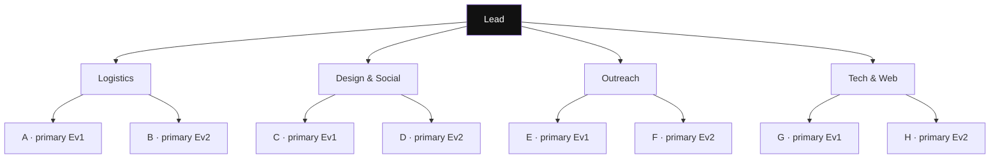
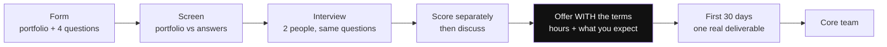

One guy handled the livestream setup with me. His father had a medical emergency and he had to leave. That was it — nobody else within travelling distance knew the setup, owned any of the gear, or could pick it up on two days' notice.

I ran that program alone for a while after. Badly.

That's the story I keep going back to, because almost everything else about those two core teams went right. I ran a GDSC chapter and named my teams after Power Rangers SPD, because that's the show I grew up on. A Squad came first. B Squad was the succession plan I started building before I needed one — about 67 applications, 20-something interviews, roughly 10 selected, all second-years, all strangers to me. Both squads shipped. People still bring that chapter up to me.

So this is what I'd do now if I were picking a core team again. What I did, what I got wrong, and the part that has nothing to do with picking at all.

---

## What I picked on

Three things, roughly in this order.

**Confidence.** Will this person put their name on something in public? Stand in front of a room? Own it if it flops?

**Charisma.** Do people like being around them? A community is a social thing. A club run by three brilliant people nobody wants to talk to is just a study group.

**Competence.** Can they do the thing.

And then one more filter that isn't a trait: do I know them well enough to trust them, and can we stand each other on a bad week.

Three Cs and a gut check. It worked. Both times.

## The part I got wrong

I knew this one the whole time. I'd just never said it out loud.

At the end of my tenure I had every core team member fill out a form — what worked, what didn't, what they actually got out of the year. That form taught me a lot of things. This was one of them, and it didn't land as news. It landed as confirmation of something I'd been carrying around the whole time and never put into words.

Everyone I picked was competent for what I picked them for. Some were just exceptional at it. My designer was excellent. One guy was strong enough at development and teaching that a topic came up last-minute once and he ran the session cold, no prep. The rest of the team never got a shot at anything close to that. Not because they couldn't have.

They didn't get the shot because I never made one.

My college gave me zero support. Permissions were a nightmare, so most of what we did went online. Everyone had their own life happening. I'd never led anything that big before, and there was nobody above me telling me how any of it worked. Under all that, I ran the events I could run and I gave the work to whoever could turn it around fastest. Which is a completely reasonable thing to do when you're drowning, and it means half your team spends a semester on the bench.

Here's the actual mistake underneath it. **I didn't ask anyone what they wanted out of the club until we were already halfway through.** By the time I did ask, we were deep in it, everything was busy, and I couldn't go create openings for six people's goals on top of running the calendar. So I had a team full of capable people and I only ever used a slice of what they brought.

What saved it was that they stuck around anyway. Both squads held together and we pulled off everything we said we'd do. That's the part I'm actually proud of. But it held together on goodwill, not on design, and goodwill isn't a plan.

So the real lesson isn't about picking harder. Picking is the easy half.

**The hard half is making sure every person you picked gets to do the thing they came for.** And you can't do that if you don't know what it is on day one.

---

## The filter, rewritten

| | What it gets you | How you check it | Can you fix it later? |
|---|---|---|---|
| **Competence** | The work exists | Portfolio + one real task | Not this semester |
| **Confidence** | Someone's name is on it in public | Interview, past ownership | Yes, with reps |
| **Charisma** | The club feels approachable | Interview, references | Yes, it's teachable |
| **What they want** | They're still here in month four | Ask on the form. Then act on it. | Only if you ask early |

Competence goes first now. Not because the other two don't matter — a community really does need people who'll stand up in a room and be liked, and I'm not walking that back. It's because of the timeline.

Charisma is teachable. John Antonakis and his team at Lausanne trained working managers and MBA students in a specific set of behaviours — metaphor, contrast, conviction, how you hold yourself — and blinded raters scored them noticeably more charismatic afterwards ([Antonakis, Fenley & Liechti, 2011](https://homepages.se.edu/cvonbergen/files/2013/01/Can-Charisma-Be-Taught_Tests-of-Two-Interventions.pdf)). A workshop, basically.

Now try teaching someone to design a poster people actually stop on, in the six weeks before your event.

You can coach a quiet competent person into being fine on stage. You can't coach a charming person into shipping.

The fourth row is the one I'd fight for hardest, and it's not a filter. It's a promise. If someone tells you on the form that they want to run the Instagram for something real, and eight months later they've done nothing but move chairs, you didn't lose them because they were flaky.

---

## The two-deep rule

Every job on your team needs two people who can do it. Not one person plus a vague sense that someone else could probably figure it out.

Software people have a name for this — the **bus factor**. How many people would have to disappear before the thing stops. Bus factor of one means one person leaves and it's over. There's real data on this from open source: across 1,932 projects, 16% lost every one of their key contributors, and only 41% of those kept going afterwards ([Kovalenko, 2022](https://arxiv.org/pdf/2202.01523), citing Avelino et al).

And those are projects with commit history and public docs. A student club has none of that. Your knowledge lives in one person's DMs and one person's Canva login.

I ran with a bus factor of one on almost everything and got away with it right up until I didn't.

### How to do it without making someone feel like the spare

I think about it like F1. Two drivers per department, both of them actually race-capable. The difference between them isn't "lead and assistant" — it's who has priority *for this event*.

That distinction matters more than it sounds. F1's history with designated number twos is a history of people getting bitter and leaving. Tell someone they're the backup and you've hired someone who'll act like a backup and then quit like one.

So swap the primary every event. Same two people, alternating who makes the call and who supports.

Three people in a department is a different shape. Two peers plus a captain doesn't work — you get one person doing the job and two people waiting to be told what to do. What works is one owner plus two people with their own named piece. Not "help with design." More like: you own event-day signage, you own the Instagram grid. Three people who each own something specific gives you a bus factor of two for free.

And you assign it. Don't put it to a vote. Letting the team decide who leads a department is how you end up with nobody leading it.

### One more rule, and it's the cheapest thing here

Every job that happens more than once gets a doc. Someone new should be able to run it from the doc alone.

Streaming setup. Sponsor outreach template and where the pipeline stands. Venue contacts and what each one charges. Ticket platform logins. Which printer near campus does same-day.

Fifteen minutes per job. I didn't do it. That's why I ran a livestream program by myself for a month.

---

## The form

Everything below is a field, plus what you're really reading for.

### A portfolio link. Anything.

Website, GitHub, Instagram page, a Notion doc, a Drive folder of posters they made for their department fest. Doesn't matter. If they don't have one, making one is the first assignment.

The reason is boring and well-established: samples of actual work and structured interviews predict performance far better than résumés and credentials do ([Sackett et al, 2022](https://pubmed.ncbi.nlm.nih.gov/34968080/)). So look at the work.

**On AI and getting someone else to build it:** totally fine. If a student vibe-codes their portfolio in an afternoon or gets a friend to do it, that tells me they know how to get things done through other people, which is most of the job anyway. Two rules though:

- The story on the page has to be true.
- They have to be able to talk about it at the level it's written at.

That second one is the whole test. It's why the portfolio and the interview only work as a pair. If the site says "led a 200-person event" and the person sitting in front of you can't tell you how many volunteers they had or what went wrong on the day — you know. Not because they're a liar. Because somebody wrote their story for them and they didn't read it closely.

Keep the floor low, though. A polished personal site filters for money and free time as much as ability. Say straight out on the form that an Instagram page or a Drive folder counts. You want the person who's done things and never packaged them.

### Departments they're interested in — let them pick more than one

You're not asking them to commit. You're finding out where their story points. The gap between what they ticked and what their portfolio shows is often the most interesting thing on the form.

### "What do you want to get out of this?"

This is the one. This is the question I skipped until it was too late, and everything I got wrong came out of that.

Any honest answer is fine. Reach. A network. Design reps. Something to write about in an application. Learning to run an event without panicking. Getting better at talking to people. All good.

What matters is that you now have a list of six promises, and you treat it like a list of promises.

**Reading it:** the tell is how specific they are. "I want to improve my skills" is nothing. "I want to run the Instagram for something with real traffic, because my own account has 40 followers and I can't prove I can do it" is a person you can actually manage — you know exactly what to hand them.

### "What's the coolest thing you've ever done?"

Doesn't have to be relevant. Doesn't have to be technical. Just tell me your lore.

I've asked this to nearly everyone I've ever picked and it does more work than any other single question. Saves you ten minutes of interview.

Strong answers: they were the one doing it, there's a point where it could have gone sideways, and there's a detail nobody would bother inventing. "I organised a 30-person trip and the bus cancelled at 4am."

Weak answers: a certificate restated as an achievement. "9.1 CGPA." "I got selected for X." Or something that happened *to* them instead of something they did.

### Hobbies, and what they do with free time

Half of them will fluff this. Ask anyway. Someone with no answer at all — no game, no sport, no show they're behind on — usually isn't being straight with you, or genuinely has no life outside obligations. Neither is great for a role that's supposed to be fun.

### Other clubs, and hours per week as a number

Two things. You learn what they sign up for when nobody's making them. And you learn how much of them you actually get.

Ask for a number. "6 hours a week, more on event weeks" is something you can plan around. "I'll manage" isn't.

### Two people who've worked with you

Name and how to reach them. On a campus this costs you one message and it's the highest-signal thing on the form. One senior who ran a fest with them will tell you more than a second interview round. Almost nobody does this at club level.

---

## The interview

Two interviewers minimum. Same questions for everyone in a department. Both of you score on your own *before* you talk to each other, otherwise the first person to speak decides the answer.

### Scenarios

The point isn't the right answer. It's watching someone think while slightly under pressure. Build six or eight and pull the two that fit the department.

- Your main speaker messages you 14 hours before the event that he can't make it. Room's booked, posters are up, 120 people registered. Walk me through your next two hours.
- Registrations are at 30% with two days to go. What's the first thing you do, and what won't you do?
- Someone on your team has gone quiet for five days and their part isn't done. Event is day after tomorrow.
- The venue changes on you the morning of.
- Someone posts something angry about the event in the group chat, publicly, and they're partly right.

**Reading the answers:** good ones get specific fast. Who do I call first, what do I tell the room, who's the backup speaker, when do I message the attendees. If they ask you clarifying questions before answering, that's a good sign, not stalling.

Weak ones stay at the level of feelings. "I'd stay calm and communicate transparently with everyone." That's the shape of an answer with no answer inside it.

Watch for whether they'll take the loss. The speaker one has no clean save. Some people will keep inventing rescues instead of saying "at some point I announce it and we run a smaller event." That refusal to accept a bad outcome and move is exactly what freezes people at 9am on event day.

### The tone match

Most useful read in the whole process: does the person in the room match the person on the page?

Confident page, confident person — good. Modest page, sharp person — great, they're underpackaged and you just found something. Loud page, person who can't discuss it — there's your answer.

You'll usually just know. That instinct is fine, and the second interviewer is there to check it.

---

## Tell them the annoying parts before they say yes

My original plan was to send the hard terms *after* the interview, once we'd decided someone was in. "Hey, is it okay if you can't be in every other club's events while you're doing this?"

Wrong order.

Telling people the unattractive parts up front is one of the oldest tested moves in hiring — the realistic job preview. Across 40 studies it cut people quitting and improved how they performed ([Phillips, 1998](https://journals.aom.org/doi/abs/10.5465/256964?journalCode=amj)). The follow-up work found the thing doing most of the work isn't managing expectations at all. It's that the candidate decides **you're honest with them** ([Earnest, Allen & Landis, 2011](https://onlinelibrary.wiley.com/doi/abs/10.1111/j.1744-6570.2011.01230.x)).

Which means the timing *is* the message. Terms on the form: we're straight with you. Terms after you're selected: we knew and we waited until you were invested. Same words, opposite signal.

And on the other end of it, being vague about what the job is doesn't keep people either. Unclear roles lead to burnout, and burnout leads to people quitting — that's the chain that shows up over and over in volunteer organisations ([summary here](https://www.evidencebasedmentoring.org/major-factors-in-volunteers-intent-to-quit/)).

So put it on the form, plainly:

> This is roughly 6–8 hours a week, more in the week before an event. If you're already in three other clubs this probably won't work, and we'd rather hear that now than in month three.

Fewer applications. Better team.

---

## The first 30 days

Picking is maybe 60% of it. The rest is setup.

**One real thing shipped in month one.** Not onboarding. An actual deliverable — a poster set, a sponsor list with 20 researched names, the event page. You learn more from three weeks of real work than from any interview, and it's a much cheaper place to find out it isn't working.

**Access on day one.** If only you can post to Instagram, log into the registration platform or reply to the outreach inbox, your bus factor is one no matter how many people you picked.

**A goals doc, and a monthly look at it.** Every person's answer to "what do you want out of this," in one document, with their name next to it. Once a month you read it and ask yourself who hasn't gotten anything yet. This is the whole thing I missed, and it's fifteen minutes.

**Make it safe to say "I'm behind."** Google studied 180 of its own teams and found that *who* was on a team mattered less than how they worked together, and the biggest single factor was whether people could admit a mistake without getting punished for it ([re:Work](https://rework.withgoogle.com/intl/en/guides/understand-team-effectiveness)). In a student team that's very concrete. The person who noticed a problem four days ago and didn't want to look like they were undermining the primary is how events fall over.

**Fixed terms and a written handover.** One semester or one event cycle, then a conversation about renewing. Sounds harsh, but it lets people leave without it feeling like a betrayal — and they will leave. My entire first squad did. Everyone graduates. That's why I started building B Squad before I needed it.

**An exit form at the end of the tenure.** Every member, same questions: what worked, what didn't, what did you actually get out of this. Mine told me things I'd suspected for a year and never checked. Do it while they still care enough to answer honestly.

---

## Where this works

The core of it — competence first, two-deep, real work samples, same questions for everyone, terms up front, and knowing what each person wants — transfers to most places where a small volunteer team has to ship on a deadline.

- **College clubs and chapters.** GDSC, IEEE, ACM, technical and cultural fests. Where I learned it.
- **Cross-college event collectives.** Students from multiple campuses, outside venues, sponsors. Two-deep matters more here, because there's no college administration underneath you when someone vanishes.
- **Hackathon organising teams.** Fixed date, brutal last mile, everything crammed into 48 hours. Highest-consequence version of a bus factor of one.
- **Content and media teams.** One person edits, one person publishes, and there's a doc — or the channel dies the week that person has exams.
- **Anything that touches money.** If your community sells tickets or takes sponsorship, everything above still applies, but you owe the team a written answer on what they get out of it before the first event, not after the first profitable one.

---

## Short version

Pick for competence, break ties on charisma, hire two people for every job, tell them the annoying parts before they say yes, and write down what each person wants on day one instead of month five.

I learned four of those five by getting them wrong.

---

### References

- Antonakis, J., Fenley, M., & Liechti, S. (2011). *Can Charisma Be Taught? Tests of Two Interventions.* [PDF](https://homepages.se.edu/cvonbergen/files/2013/01/Can-Charisma-Be-Taught_Tests-of-Two-Interventions.pdf)
- Earnest, D. R., Allen, D. G., & Landis, R. S. (2011). *Mechanisms Linking Realistic Job Previews with Turnover.* [Link](https://onlinelibrary.wiley.com/doi/abs/10.1111/j.1744-6570.2011.01230.x)
- Google re:Work. *Understand team effectiveness* (Project Aristotle). [Link](https://rework.withgoogle.com/intl/en/guides/understand-team-effectiveness)
- Kovalenko, V. (2022). *Bus Factor In Practice.* [PDF](https://arxiv.org/pdf/2202.01523)
- Phillips, J. M. (1998). *Effects of Realistic Job Previews on Multiple Organizational Outcomes.* [Link](https://journals.aom.org/doi/abs/10.5465/256964?journalCode=amj)
- Sackett, P. R., Zhang, C., Berry, C. M., & Lievens, F. (2022). *Revisiting Meta-Analytic Estimates of Validity in Personnel Selection.* [Link](https://pubmed.ncbi.nlm.nih.gov/34968080/)
- *Major Factors in Volunteers' Intent to Quit.* Chronicle of Evidence-Based Mentoring. [Link](https://www.evidencebasedmentoring.org/major-factors-in-volunteers-intent-to-quit/)
